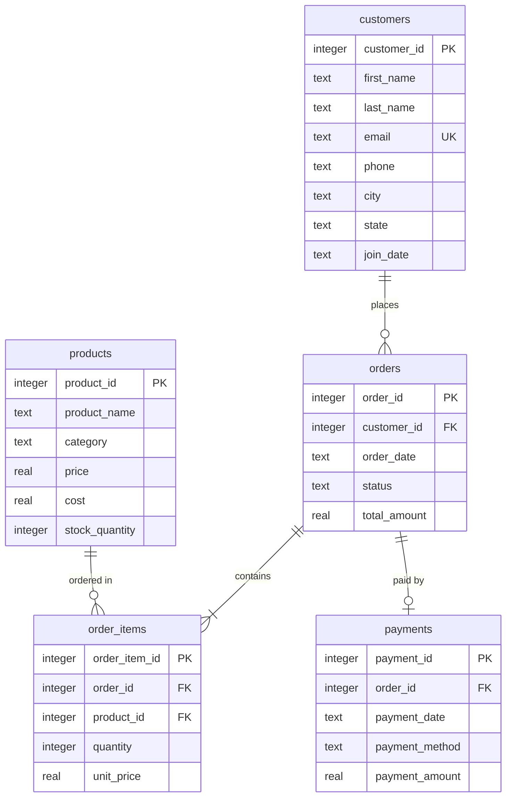

# 📊 Sales Data Analysis Using SQL

An end-to-end relational database analysis project designed to extract actionable business intelligence from structured sales, customer, and payment data.

This project implements a fully relational database, generates transactional mock history, validates data quality, and runs advanced analytical queries to uncover trends in revenue, customer behavior, and product performance.

---

## 🏗️ Database Architecture

The project schema represents a typical retail e-commerce database with 5 interconnected tables structured with foreign keys, checks, and cascade rules.



### Table Definitions
1. **`customers`**: Stores profile information, location details, and registration dates.
2. **`products`**: Maintains catalog items with sales prices, acquisition costs (for margin calculation), and stock counts.
3. **`orders`**: Logs transactional metadata including order timestamps, completion statuses, and overall totals.
4. **`order_items`**: Resolves the many-to-many relationship between orders and products, capturing quantity and historical price at transaction time.
5. **`payments`**: Details receipt values, dates, and payment methods.

---

## 🚀 How to Run the Project

This project runs out of the box using Python's standard library (no pip installations required).

### 1. Initialize the Database
Build the schema and create the SQLite database file:
```bash
python scripts/db_setup.py
```

### 2. Populate Mock Data
Generate a realistic 12-month transaction history:
```bash
python scripts/generate_data.py
```

### 3. Run Data Audit
Validate data cleanliness, check temporal logic, and audit key constraints:
```bash
python scripts/run_audit.py
```

### 4. Execute Analysis & Generate Report
Run the analytical suite and output a detailed Markdown summary:
```bash
python scripts/run_analysis.py
```
*Outputs will be exported to [reports/analysis_report.md](file:///reports/analysis_report.md)*

---

## 📈 Key Business Insights & Findings

The SQL analysis of the generated database yielded the following core results:

### 1. High-Growth Revenue Trends
Total monthly revenue climbed steadily from **$1,419.93 in Jan 2025** to a peak of **$142,105.59 in June 2026**, indicating significant growth. 

### 2. Profit Margins by Category
While **Apparel** features the highest individual margin rate, **Electronics** remains the absolute profit engine of the business:
- **Apparel**: 44.99% Margin ($30,339.11 Profit)
- **Office Supplies**: 43.10% Margin ($52,709.85 Profit)
- **Home Appliances**: 40.98% Margin ($51,193.64 Profit)
- **Electronics**: 37.91% Margin ($163,307.32 Profit)

### 3. Top-Performing Products
- **By Volume:** **Classic Leather Jacket** (185 units) & **Laptop Pro 15** (178 units)
- **By Value:** **Laptop Pro 15** ($231,398.22 revenue) & **Smartphone X** ($131,198.36 revenue)

---

## 💻 Sample SQL Showcase

Here is an example of an advanced SQL query implemented in the analysis suite:

### Category Profit Margins
```sql
SELECT 
    p.category,
    ROUND(SUM(oi.quantity * oi.unit_price), 2) as total_revenue,
    ROUND(SUM(oi.quantity * p.cost), 2) as total_cost,
    ROUND(SUM(oi.quantity * oi.unit_price) - SUM(oi.quantity * p.cost), 2) as total_profit,
    ROUND(((SUM(oi.quantity * oi.unit_price) - SUM(oi.quantity * p.cost)) / SUM(oi.quantity * oi.unit_price)) * 100, 2) as profit_margin_percent
FROM order_items oi
JOIN products p ON oi.product_id = p.product_id
JOIN orders o ON oi.order_id = o.order_id
WHERE o.status != 'Cancelled'
GROUP BY p.category
ORDER BY total_profit DESC;
```

---

## 🎯 Actionable Recommendations
1. **Optimize Electronics Margins**: Since Electronics represent our biggest sales driver but lowest margin (37.91%), consider bundle-pricing high-margin accessories (like Wireless Headphones at 43.3% margin) with Laptops/Smartphones.
2. **Promote High-Margin Categories**: Shift marketing promotions towards high-margin categories like Apparel (44.99% margin) and Office Supplies (43.10% margin) to maximize bottom-line profit.

