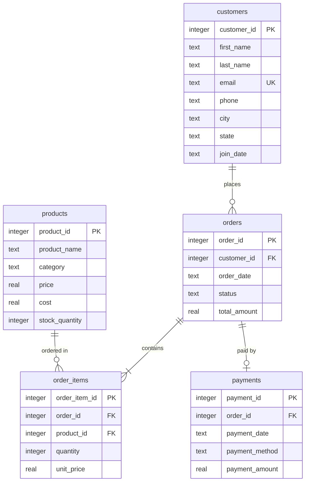

# 📊 Sales Data Analysis Using SQL - Day 1: Schema Design & ERD Setup

An end-to-end relational database analysis project designed to extract actionable business intelligence from structured sales, customer, and payment data.

This project implements a fully relational database structured with primary keys, foreign keys, checks, and cascade rules to analyze sales trends and customer behavior.

---

## 🏗️ Database Architecture

The project schema represents a typical retail e-commerce database with 5 interconnected tables.

### Table Definitions
1. **`customers`**: Stores profile information, location details, and registration dates.
2. **`products`**: Maintains catalog items with sales prices, acquisition costs (for margin calculation), and stock counts.
3. **`orders`**: Logs transactional metadata including order timestamps, completion statuses, and overall totals.
4. **`order_items`**: Resolves the many-to-many relationship between orders and products, capturing quantity and historical price at transaction time.
5. **`payments`**: Details receipt values, dates, and payment methods.
